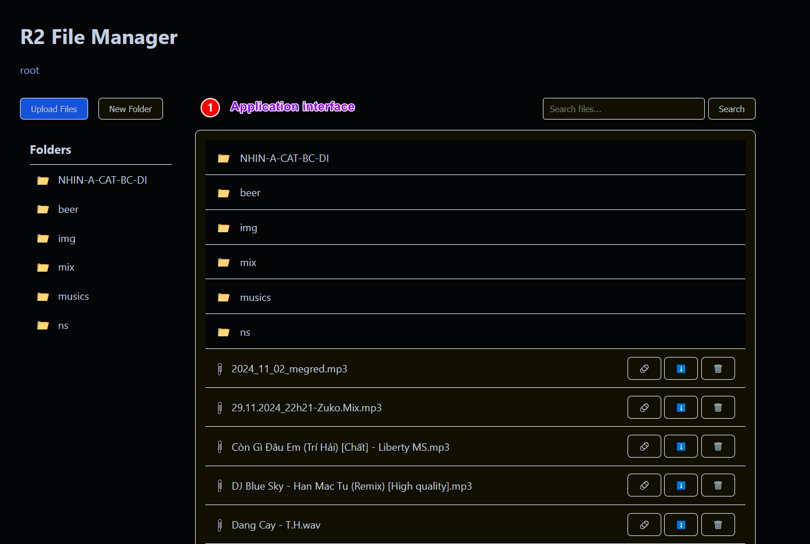
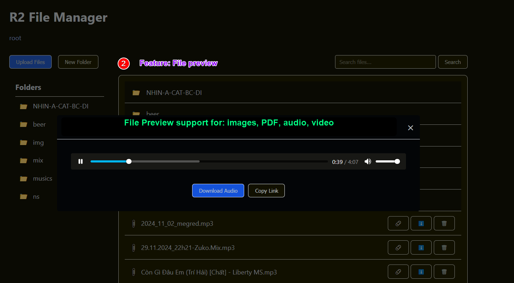
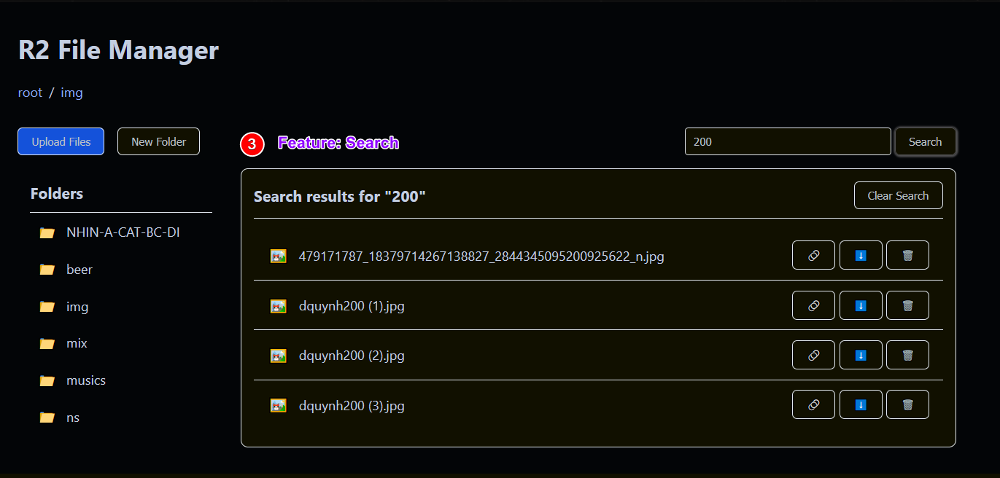

<a href="http://zuko.pro/">
    
</a>
# R2 Manager

# :fire: Web Manager for Cloudflare's R2 :fire:

**A simple web-based file manager for Cloudflare R2 storage. Run on Cloudflare worker**

## Features

💠 Access protection via Basic Auth. You can control that via deploy .env<br/>
💠 Browse, upload, and download files<br/>
💠 Create and navigate folders<br/>
💠 Search for files by name<br/>
💠 Preview compatible file types (images, text, PDF, audio, video)<br/>
💠 Direct CDN links for media files<br/>
💠 Here is some preview of application<br/>





## Configuration

1. Copy `wrangler.toml.sample` to `wrangler.toml`
2. Update the following configuration variables:

- `ADMIN_AUTH_BASIC_USR_PWD`: Set username:password for basic auth
- `CDN_BASE_URL`: Set the base URL for your CDN (e.g., `https://your-cdn.r2.dev`)

## Development

```bash
npm install
npm run dev
```

## Deployment

```bash
npm run deploy
```

## License

MIT